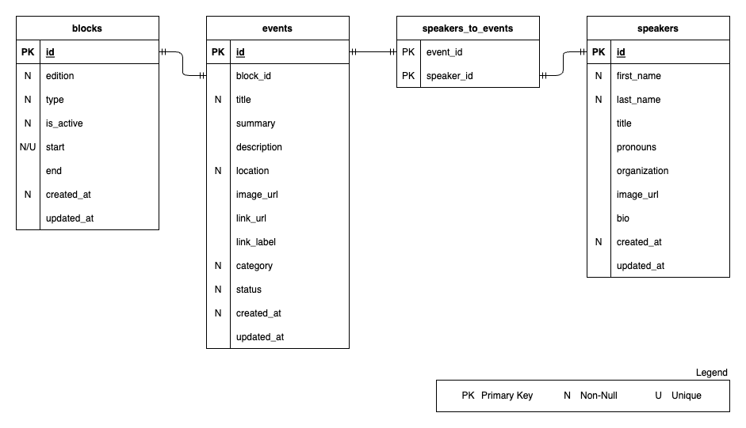

# Outlier Microfrontend

This project is a microfrontend for the Outlier Conference.

## Architecture


This project is built with the following technologies:

| Technology                              | Description                          | Quality Attribute                |
| --------------------------------------- | ------------------------------------ | -------------------------------- |
| [Docker](https://www.docker.com)        | Containerization platform            | `Performance`, `Maintainability` |
| [Next.js](https://nextjs.org)           | A React framework for production     | `Performance`, `Usability`       |
| [Drizzle](https://orm.drizzle.team)     | ORM for managing database and schema | `Usability`, `Maintainability`   |
| [Tailwind CSS](https://tailwindcss.com) | A utility-first CSS framework        | `Usability`, `Maintainability`   |
| [tRPC](https://trpc.io)                 | End-to-end typesafe APIs             | `Reliability`, `Maintainability` |

## Getting Started

Before getting started, make sure you have the following installed:

- [Docker](https://www.docker.com)
- [Node.js](https://nodejs.org)
- [Bun](https://bun.sh)

To get started, run the following commands:

```bash
# Install dependencies
bun install

# Create environment file
cp .env.example .env
```

To start the development server, run:

```bash
# Set up the database
docker compose up
bun db:generate
bun db:migrate
```

In a separate terminal, run:

```bash
# Start the development server
bun dev
```

To have a look in the database, run:

```bash
# Start the database IDE
bun db:studio
```

## Authentication

The authentication is handled by `next-auth`, and uses Role-Based Access Control
(RBAC) to manage user permissions. Currently, there are two roles: `ADMIN` and
`USER`. The `ADMIN` role has full access to the application and can add, edit
and delete the schedule. The `USER` role has limited access, but is able to view
the schedule, and add and edit Unconf sessions.

Currently the `USER` role is authenticated by OAuth providers:

| Provider | Setup                                                       | environment variable                   |
| -------- | ----------------------------------------------------------- | -------------------------------------- |
| GitHub   | [docs](https://authjs.dev/getting-started/providers/github) | `AUTH_GITHUB_ID`, `AUTH_GITHUB_SECRET` |
| Slack    | [docs](https://authjs.dev/getting-started/providers/slack)  | `AUTH_SLACK_ID`, `AUTH_SLACK_SECRET`   |

For the `ADMIN` role, the user is authenticated by a username and password. The
user name is `admin` and the password is set via the `AUTH_ADMIN_PASSWORD`
environment variable.

## Database

The database is a PostgreSQL database, and is managed by `Drizzle`. The schema
is defined code-first, and is located in the `src/db/schema` folder.



The three entities are:

- `Blocks`: The blocks are the time slots for the schedule. They have a start
  and end time, and a type.
- `Events`: The events are the talks and workshops that are scheduled. They have
  a title, description, and various metadata around whats happens.
- `Speakers`: The speakers are the people who are giving the talks and
  workshops. They have a name, bio, and a picture.

The relationships between the entities are:

- `Blocks` have **one** `Event`
- `Events` have **many** `Speaker`
- `Speakers` have **many** `Event`

## Internationalization

The application is internationalized using
[`next-intl`](https://next-intl-docs.vercel.app/). With the translation files
located in the `/messages` folder. The translation files are in JSON format and
are named according to the locale they represent. For example, the English
translation file is named `en.json`.

Currently, the application supports the following locales:

- English (`en`)
- Spanish (`es`)
- French (`fr`)
- German (`de`)
- Italian (`it`)
- Portuguese (`pt`)
- Japanese (`ja`)
- Chinese (`zh`)

### Adding a new locale

To add a new locale, create a new JSON file in the `/messages` folder with the
locale name as the file name and update the `i18n.ts` config.

For example, to add a Dutch translation:

1. create a file named `nl.json`
1. add the translations for each key in the file.
1. add the locale to the i18n.languageSelect key for all the other locales
1. add the locale to the `Locale` type and the `ALL_LOCALES` array in the
   `/src/lib/i18n.ts` file.
